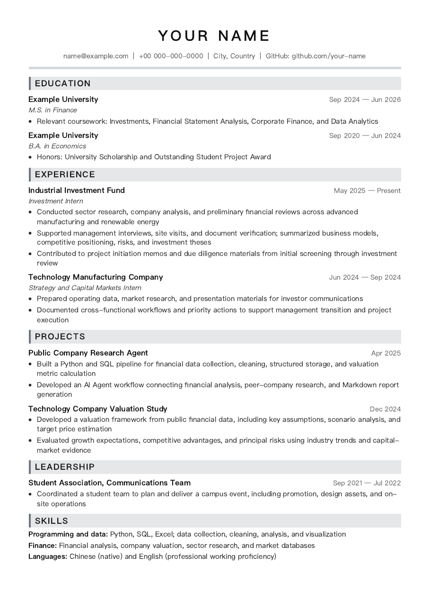

# Marp A4 Resume Toolkit

[](https://github.com/chaoyian/marp-a4-resume-toolkit/actions/workflows/ci.yml)
[](LICENSE)
[](https://nodejs.org/)

English | [简体中文](README.md)

A bilingual A4 resume toolkit built with Marp. Maintain the content in Markdown and generate consistently formatted PDFs with a project-pinned Marp CLI, without relying on VS Code export.



## Features

- Standards-based A4 PDF output
- Chinese and English templates
- Project-pinned Marp CLI
- Command-line and macOS double-click export
- Purpose-and-timestamp filenames
- One-page and manual multi-page layouts
- Personal resumes and generated files remain untracked by default

## Requirements

- Node.js 18 or later
- npm
- Chrome or Chromium

VS Code and the Marp extension are optional preview tools.

## Installation

```bash
git clone https://github.com/chaoyian/marp-a4-resume-toolkit.git
cd marp-a4-resume-toolkit
npm install
```

## Create a resume

Chinese:

```bash
npm run init:zh
```

English:

```bash
npm run init:en
```

The command creates a local `resume.md` from the selected template and never overwrites an existing file. Edit `resume.md`, then run:

```bash
npm run build
```

Output:

```text
output/pdf/resume.pdf
```

## Interactive export

```bash
npm run export
```

After entering a purpose, the toolkit creates a timestamped file such as:

```text
output/pdf/investment-internship_2026-07-23_19-30-00.pdf
```

On macOS, you can also double-click:

```text
scripts/export-resume.command
```

## Examples and previews

```bash
npm run build:zh        # Chinese example PDF
npm run build:en        # English example PDF
npm run build:examples  # Both examples
npm run preview         # Local resume.md
npm run preview:zh      # Chinese example
npm run preview:en      # English example
```

## Project check

```bash
npm run check
```

This validates the project structure, A4 theme, example configuration, and local-file boundary, then builds both example PDFs.

## Documentation

- [Architecture and dependencies](docs/ARCHITECTURE.md)
- [Privacy design](docs/PRIVACY.md)

The project structure, scripts, and documentation were refactored with AI assistance and reviewed by a human.

## License

[MIT](LICENSE)
