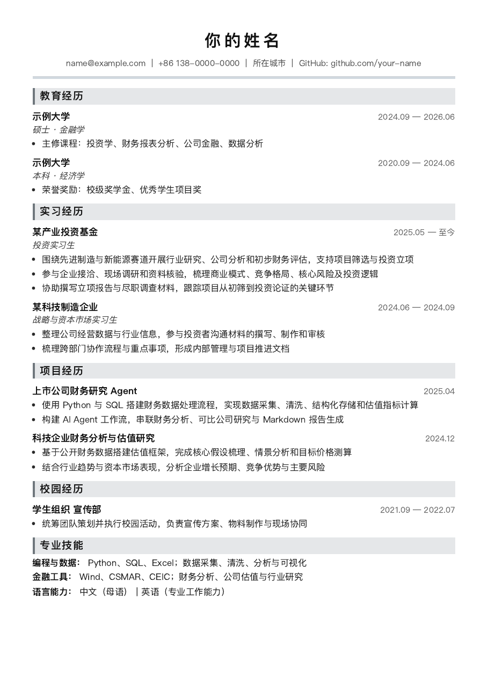

# Marp A4 Resume Toolkit

[](https://github.com/chaoyian/marp-a4-resume-toolkit/actions/workflows/ci.yml)
[](LICENSE)
[](https://github.com/chaoyian/marp-a4-resume-toolkit/releases)

[English](README.en.md) | 简体中文

使用 Markdown 维护内容、通过 Marp 生成标准 A4 PDF 的双语简历工具包。v2.0 提供 Windows、macOS 和 Linux 便携包，多版本简历可以在同一个启动器中选择。



## 直接下载（推荐）

从 [Releases](https://github.com/chaoyian/marp-a4-resume-toolkit/releases/latest) 下载与你的系统对应的文件：

| 系统 | 下载文件 | 启动方式 |
| --- | --- | --- |
| Windows x64 | `windows-x64.zip` | 双击 `Launch Resume Toolkit.cmd` |
| macOS Apple Silicon | `macos-arm64.zip` | 双击 `Launch Resume Toolkit.command` |
| macOS Intel | `macos-x64.zip` | 双击 `Launch Resume Toolkit.command` |
| Linux x64 | `linux-x64.tar.gz` | 运行 `launch-resume.sh` |

发行包已内置 Node.js 和固定版本的 Marp CLI，不需要安装 Node.js、npm 或 VS Code。PDF 导出需要以下任一系统浏览器：

- Windows：Microsoft Edge、Google Chrome 或 Firefox
- macOS：Google Chrome、Microsoft Edge 或 Firefox（不支持 Safari）
- Linux：Chrome、Chromium、Microsoft Edge 或 Firefox

首次启动时选择中文或英文模板。工具会在 `resumes/` 中创建本地简历；编辑并保存后再次启动，用 `↑ / ↓` 选择版本并按 `Enter` 导出。

```text
resumes/
├── 投研通用版.md
├── 国企基金版.md
└── resume-en.md

output/pdf/
└── 国企基金版_2026-09-01_10-30-00.pdf
```

同一秒重复导出会自动追加序号，不会覆盖旧 PDF。导出成功后会尝试使用系统默认 PDF 阅读器打开。

> 便携版升级前请备份 `resumes/` 与 `output/`。首版使用压缩包分发，没有 Windows 代码签名或 macOS 公证，系统可能显示安全提示。

## 从源码使用

开发者或需要修改脚本的用户可以克隆仓库：

```bash
git clone https://github.com/chaoyian/marp-a4-resume-toolkit.git
cd marp-a4-resume-toolkit
npm install
npm run init:zh
npm run export
```

源码模式要求 Node.js 18+、npm 和兼容浏览器。常用命令：

```bash
npm run init:zh
npm run init:en
npm run export
npm run export -- "resumes/国企基金版.md"
npm run preview -- "resumes/国企基金版.md"
npm run doctor
npm run check
```

如果浏览器安装在非标准位置，可以设置 `BROWSER_PATH` 为浏览器可执行文件的绝对路径。

## 主题与分页

默认主题为 `a4-resume`。宋体风格主题使用：

```yaml
theme: a4-resume-serif
```

Marp 将每张幻灯片作为一个 PDF 页面，不会自动将溢出内容流到下一页。使用单独一行 `---` 手动分页，并在修改文字、字体或间距后检查生成 PDF。

## 项目结构

```text
src/          核心选择、初始化、导出与环境检测
launchers/    Windows、macOS、Linux 启动入口
scripts/      项目校验和发行打包
themes/       A4 无衬线与衬线主题
examples/     中英文公开模板
tests/        单元测试
docs/         架构、隐私与发行说明
```

更多信息见[架构与依赖](docs/ARCHITECTURE.md)和[隐私设计](docs/PRIVACY.md)。

## License

[MIT](LICENSE)
